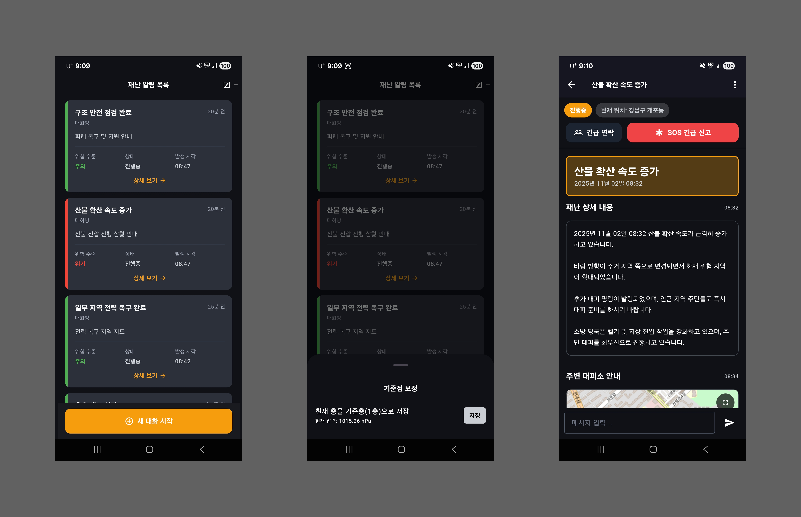

# SENSE

*[24시간의 기록](./24시간의%20기록) - 팀 SENSE 의 기록과정 바로보기*

<br>

## 팀 원 소 개

<table>
  <tr>
    <td align="center">
      <a href="https://github.com/jgim">
        <br/>
        <b>jgim</b><br/>
        김종석
      </a>
    </td>
    <td align="center">
      <a href="https://github.com/silim124">
        <br/>
        <b>silim124</b><br/>
        임시은
      </a>
    </td>
    <td align="center">
      <a href="https://github.com/RIIZE0904">
        <br/>
        <b>RIIZE0904</b><br/>
        김현서
      </a>
    </td>
    <td align="center">
      <a href="https://github.com/seok541hyun">
        <br/>
        <b>seok541hyun</b><br/>
        윤석현
      </a>
    </td>
    <td align="center">
      <a href="https://github.com/Cicada31113">
        <br/>
        <b>Cicada31113</b><br/>
        권덕현
      </a>
    </td>
  </tr>
</table>

<br>

<br>


<br>


SENSE는 재난 상황에서 사용자의 현재 위치와 상태를 바탕으로, **즉시 수행 가능한 행동 지침**과 **이동 가능한 대피 거점**을 안내하는 시스템입니다.  
본 프로젝트는 **그래프 DB**, **RAG (Retrieval-Augmented Generation)**, **온톨로지 기반 규칙**, **멀티 에이전트 LLM 파이프라인**으로 구성됩니다.



이 문서는 전체 개요를 설명합니다.  
상세 구현은 각 하위 문서를 참고하십시오:

- 모바일 앱: [`sense-mobile/README.md`](./sense-mobile/README.md)
- 백엔드/에이전트: [`sense-backend/README.md`](./sense-backend/README.md)
- 참고 문헌: [`참고문헌.md`](./참고문헌.md)

## 서론
우리는 재난 상황에서 모두에게 똑같이 울리는 문자 대신, “지금 내가 무엇을 해야 하는가”를 바로 실행 가능한 형태로 바꿔주는 개인화 계층을 만들었습니다. 이 개인화는 위로용 멘트나 모호한 조언이 아니라, 현재 위험도·이동 필요성·주변 환경을 해석해서 “지금 즉시 움직여야 하는가 / 아직 판단해도 되는가”를 명확하게 나눕니다. 기존 시스템은 이 구분 자체가 없었습니다.

우리는 이 구조를 온톨로지로 모델링했습니다. 공개 신뢰 데이터 중 우선적으로 접근 가능한 지진 데이터를 출발점으로 삼고, 사용자가 받는 안내를 ‘즉시 실행해야 하는 행동 블록’과 ‘다음 선택지를 이해시키는 맥락 블록’으로 분리했습니다. 이것은 단순 알림이 아니라, 재난 직후 수십 초부터 그 다음 몇 분까지의 의사결정 흐름 전체를 엔지니어링 가능한 형태로 만든 것입니다. 이 접근은 지진을 넘어 수해, 산불, 나아가 사전 예방 알림까지 그대로 확장 가능한 모델이며, 우리는 이번에 그 프레임을 실제로 구현했습니다. 지금은 비효율적일 수 있지만 언젠가는 누군가 만들어야 하는 계층이라고 믿었고, 우리는 이번에 그걸 처음부터 끝까지 직접 시도했습니다. 앞으로의 재난 대응 시스템에서 이 레이어는 선택이 아니라 기본이 될 것이라고 생각합니다.

## 1. 문제 정의

기존 재난 안내(예: 재난문자)는 다음과 같은 한계를 가집니다.

- 모든 사용자에게 동일한 문구가 전달된다.
- 개인 위치(현재 좌표), 건물 환경(고층/지하 등), 동반자 여부(노약자·아동 등) 등 **실제 상황이 반영되지 않는다**.
- 사용자는 “지금 어디로 가야 하는지”, “무엇을 하면 안 되는지”를 즉시 알기 어렵다.
- 일반 LLM 챗봇은 실제 주변 대피소의 위치/개방 여부, 통제 구역 여부, 금지 행동(예: 엘리베이터 사용 금지)과 같은 **안전 임계 정보를 보장하지 못한다**.

SENSE는 다음을 목표로 합니다.

### 1.1 상황별 즉시 행동 가이드 제공

- “지금 바로 할 것 / 다음 단계 / 주의·금지 사항” 형태로 안내합니다.

### 1.2 위치 기반 안전 거점 안내

- 사용자 주변 반경 내 **실제 이용 가능한 대피 지점**을 제공합니다.

### 1.3 근거 제공

- 왜 그렇게 해야 하는지 (공식 지침 기준)를 함께 제공합니다.  
- 임의 추론이 아니라, **근거를 포함한 결정임을 명확히** 합니다.


## 2. 시스템이 처리하는 입력 유형

SENSE는 두 가지 형태의 입력을 처리합니다.

### 2.1 사용자 직접 질의

사용자가 모바일 앱에서 자연어로 질문합니다.

예시:

> "지금 지진 났어. 비 오고 할머니랑 있어. 어디로 가야 해?"

이 경우 앱은 다음 정보를 서버에 전달합니다.

- 사용자 위치 (`lat`, `lon`)
- 사용자의 설명(텍스트)

서버는 이를 기반으로 다음 네 가지 블록을 반환합니다.

1. **지금 바로 수행할 행동**  
2. **다음 단계 / 이동 후보지**  
   - 예: 가장 가까운 이용 가능한 대피소  
3. **주의 / 금지 행동**  
   - 예: 지진 상황에서 엘리베이터 사용 금지  
4. **근거**  
   - 해당 지침의 이유 (공식 지침, 안전 매뉴얼 등)
```
 이 응답은 단순 생성형 답변이 아니라 아래 정보를 조합하여 생성된 결과입니다.
- 주변 시설 그래프 조회 결과
- 상태 정보(개방 여부 등)
- 안전 지침(RAG로 검색된 근거)
- 온톨로지 규칙(금지/우선순위)
```
---

### 2.2 자동 수신되는 재난 경보 (재난문자 인입)

시스템은 사용자 질문이 없어도, 공공 재난 알림 형식의 문자열을 자동으로 입력으로 받습니다.

예시:

```text
2025-11-02 15:00 서울특별시 동남쪽 2km 지역 M6.3 지진 / 낙하물, 여진주의
국민재난안전포털 참고 대응
Earthquake [기상청]
```

### 처리 흐름은 다음과 같습니다.

1. 이 경보 문구가 서버로 전달됩니다.
2. 백엔드는 문구를 파싱하여 사건 정보를 추출합니다.
   - **발생 시각:** `2025-11-02 15:00`
   - **위치 정보:** `서울특별시 동남쪽 2km`
   - **재난 유형:** `지진 (M6.3)`
   - **위험 요소:** `낙하물`, `여진 주의`
   - **출처:** `기상청 / 국민재난안전포털`
3. 이 정보는 새로운 **“사건(Room)”** 으로 저장됩니다.
4. 모바일 앱의 사건 목록 화면(Room 리스트)에 이 Room이 즉시 나타납니다.
5. 사용자는 해당 Room을 열어, 이미 생성된 대응 지침(**즉시 행동 / 다음 단계 / 주의 / 근거**)을 확인할 수 있습니다.

즉, 사용자가 직접 묻지 않아도  
**“현재 지역에서 무슨 일이 발생했고 지금 무엇을 해야 하는가?”** 를 확인할 수 있습니다.

자동 수신 → Room 생성 → 사용자 단말 노출에 대한 상세 로직은 아래 문서에 설명되어 있습니다.

- 백엔드 측 파이프라인: `sense-backend/README.md`
- 모바일 표시 방식: `sense-mobile/README.md`

---

## 3. 시스템 아키텍처 (요약)

```text

Mobile App  (Flutter)
- 사용자 입력 \(또는 자동 수신된 사건 선택)
- 현재 위치(lat, lon)
- 결과 UI 카드 표시
        │  /query
        ▼
sense-backend (FastAPI)      
                              
1. PlanAgent                  
   - 상황/위험/요구 파악
     (재난 종류, 긴급도,
      이동 제약 등)
                               
2. GroundAgent                
    - Neo4j 조회:
      주변 대피소, 통제 구역 등
    - Chroma RAG 조회:
      공식 안전 지침, 주의 문구
    - Evidence Packet 생성
                               
3. DecisionAgent              
    - 우선 행동 / 금지 행동 결정
    - "지금 / 다음 / 주의" 정리
    - 안전 가드레일 적용
                               
4. Orchestrator               
    - Mobile에서 바로 노출 가능한
      최종 응답(JSON) 생성
                               
* Safety Guardrail           
    - 고위험 지시 자동 차단
        │
        ▼
Mobile App
- Room 목록 및 상세 카드 UI
```

### 핵심 특징

- 단일 LLM에 직접 질의 후 그대로 응답하는 **단일 스트림 구조가 아닙니다.**  
  `Plan → Ground → Decision → Orchestrator` 로 단계가 분리된 **멀티 에이전트 구조**입니다.

- 각 단계 간 데이터는 **Pydantic 스키마**로 정의되어 있어, 입력/출력 형태가 명확합니다.

- `Decision` 단계에서 **안전 가드레일**  
  (예: “지진 상황에서 엘리베이터 사용 금지”)을 강제합니다.

- `Orchestrator` 단계에서 최종 응답은  
  **모바일 UI 컴포넌트에서 그대로 렌더링 가능한 형태(JSON)** 로 변환됩니다.


## 4. 구성 요소별 역할

### 4.1 모바일 클라이언트 (`sense-mobile`)

문서: [`sense-mobile/README.md`](./sense-mobile/README.md)

**기술 스택**
- Flutter 기반 iOS/Android 클라이언트  
- Riverpod을 이용한 상태 관리

**주요 역할**
- 사용자 현재 위치와 상황(텍스트 질의)을 서버에 전달
- 서버의 응답(JSON)을 카드 형태로 렌더링:
  - “지금 바로 할 것”
  - “다음 단계”
  - “주의 / 금지”
- 사건(Room) 리스트 관리:
  - 서버가 자동으로 생성한 재난 이벤트(예: 지진 알림)를 Room 단위로 표시
  - 사용자는 Room을 선택하여 해당 상황의 최신 대응 지침을 확인

### 4.2 백엔드 (`sense-backend`)

문서: [`sense-backend/README.md`](./sense-backend/README.md)

**기술 스택**
- FastAPI 기반 서비스  
- `/query` 엔드포인트 제공

**주요 구성 요소**

#### PlanAgent
- 사용자 질문 또는 자동 수신된 경보 문구를 해석하여  
  재난 유형, 긴급도, 이동 제약(예: 노약자 동반 등), 위험 요소를 **구조화**합니다.

#### GroundAgent
- Neo4j(그래프 DB)에서 반경 내 대피소, 통제 구역, 위험 지역 등을 조회합니다.
- Chroma(벡터 DB)에서 관련 안전 지침과 주의 문구를 검색합니다.
- 결과를 **Evidence Packet**으로 정리합니다.

#### DecisionAgent
- Evidence Packet과 온톨로지 규칙을 기반으로  
  우선 행동 / 금지 행동 / 주의사항 / 다음 이동 단계를 결정합니다.
- 재난별 안전 가드레일(예: “지진 상황에서 엘리베이터 사용 금지”)을 **강제로 포함**합니다.

#### Orchestrator
- 모바일에서 바로 렌더링 가능한 **최종 JSON 응답**을 생성합니다.


### 4.3 데이터 계층

#### Neo4j (그래프 DB)
- 대피소, 통제 구역, 위험 지역 등의 지리 자산을 노드/관계로 저장  
- 속성 예시:
  - 좌표(lat/lon)
  - 개방 여부(open)
  - 시설 유형 등
- 목적:  
  “현재 위치 기준으로 실제로 이동 가능한 안전 후보지” 산출

#### Chroma (벡터 DB)
- 공공 안전 지침, 대응 매뉴얼 등의 텍스트를 임베딩 후 검색  
- “왜 이런 행동이 필요한가”에 대한 **설명 근거** 제공

에이전트 단계, 스키마 구조, 요청/응답 예시는  
`sense-backend/README.md`를 참고하십시오.


## 5. 온톨로지, 그래프, RAG

### 5.1 온톨로지 (Ontology)

재난 상황에서의 의사결정을 구조화합니다:

- 재난 유형 (**Hazard**)  
- 취약 조건 (**Vulnerability**)  
- 금지 행동 (**Restriction**)  
- 행동 우선순위 (**Action Priority**)

**예시 규칙**

- **조건:**  
  “지진 + 고층 + 노약자 동반”

- **규칙:**  
  - 엘리베이터 사용 금지  
  - 낙하물 위험 주의  
  - 여진 대비 안정 자세 유지

이 규칙은 모델의 추정이 아니라 **사전 정의된 정책**으로 관리됩니다.


### 5.2 그래프 (Neo4j)

- 대피소, 통제 구역, 위험 지역 등의 자산을 **노드/관계로 저장**합니다.  
- 각 노드는 위치 좌표, 개방 여부 등 **상태 정보를 포함**할 수 있습니다.  
- 사용자의 좌표를 기준으로 거리 계산을 수행하여  
  실제 접근 가능한 후보지만 반환합니다.


### 5.3 RAG (Chroma)

- 공공 안전 지침, 대응 매뉴얼 등의 비정형 문서를 임베딩하여 검색합니다.  
- 검색된 텍스트 스니펫은 `DecisionAgent` 단계에서 **“근거”** 로 사용됩니다.  
- 최종 응답에는 행동 지침뿐 아니라:
  - 왜 그 지침이 필요한지  
  - 어떤 공식 문서/매뉴얼에 근거하는지  
  까지 포함됩니다.

해당 검색과 근거 전달 흐름은  
`sense-backend/README.md`에 설명되어 있습니다.


## 6. 리포지토리 구조

```text
├─ sense-mobile/              # Flutter 기반 모바일 클라이언트
│  └─ README.md               # UI 흐름, 상태 관리, 라우팅 구조
│
├─ sense-backend/             # FastAPI 백엔드 + 에이전트 파이프라인
│  └─ README.md               # /query 동작 방식, 에이전트 단계, 예시 요청/응답
│
│
└─ README.md                  # (현재 문서)
```


